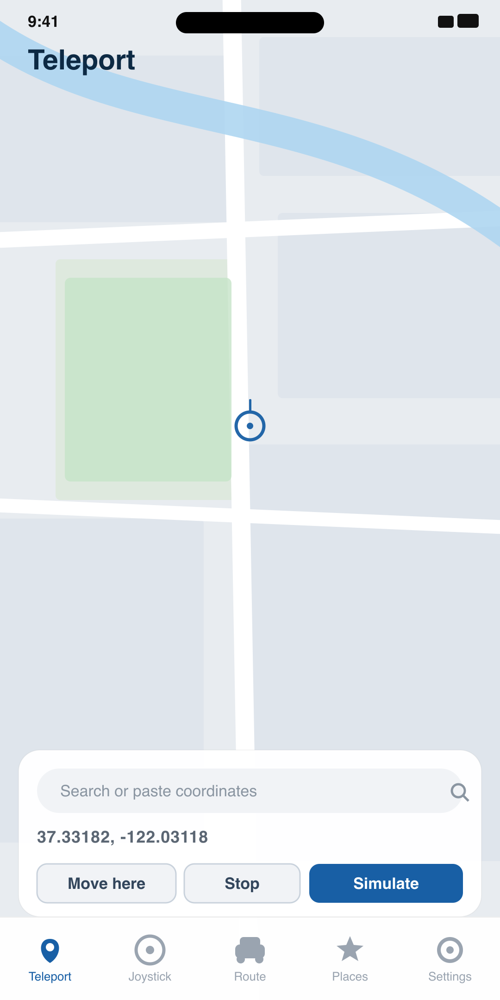
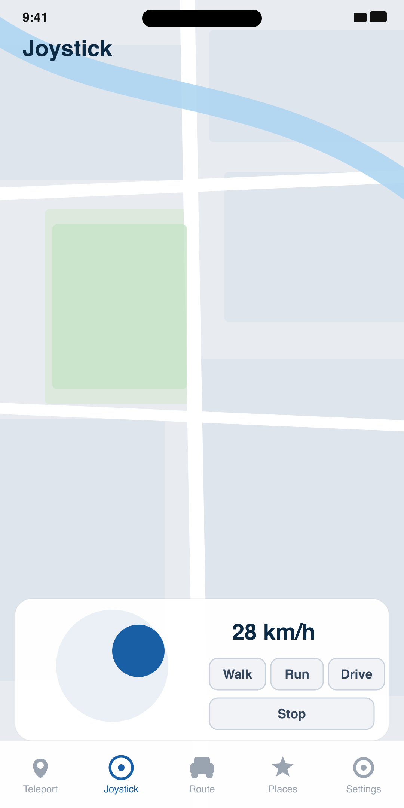
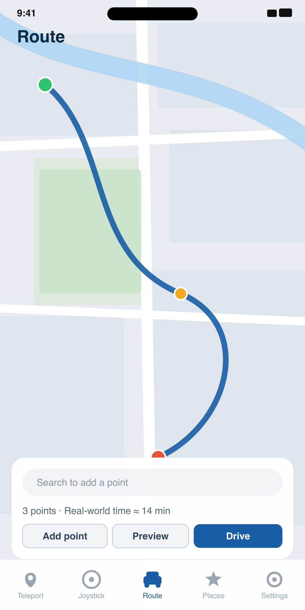

# Wander

### Set your iPhone's location to anywhere in the world — free, no jailbreak.

Teleport with a tap, roam with an on‑screen joystick, or drive a real road route at realistic speed. 100% on‑device. A free, open‑source alternative to **iMyFone AnyTo** and **Tenorshare iAnyGo**.

<p align="center">
  
  &nbsp;
  
  &nbsp;
  
</p>

## Get Wander

Wander isn't on the App Store — you install it with **[SideStore](https://sidestore.io)**, a free app‑installer, using Wander's *source* (a link SideStore reads). Copy this:

```
https://raw.githubusercontent.com/faisal-nabulsi/Wander/main/apps.json
```

- 🆕 **Never sideloaded before?** Don't worry — follow the **[Full setup guide](#full-setup-guide)** below. It takes about 30 minutes once (you'll need a computer for setup); after that, daily use is just *turn on the VPN app → open Wander*.
- ✅ **Already have SideStore?** In SideStore: **Sources → ➕ → paste the link → Add**, then install Wander. (Or download [`Wander.ipa`](https://github.com/faisal-nabulsi/Wander/releases/latest) and open it with SideStore.)

---

## Features

- **Teleport** — search an address (or drop a pin on the map) and set your location instantly.
- **Joystick** — a live on‑screen stick that moves your location in real time; walk / run / drive speeds.
- **Route** — set a start, stops, and an end; Wander follows the real road route and plays it back. Choose **Realistic** (paces to the real ETA, slows for turns), **Speed limit**, or **Manual** speed.
- **Places** — save favourite spots, jump back to recent ones, or pick a famous landmark.
- **Natural jitter** — optional small random drift so a fixed location looks less robotic.
- **km/h ⇄ mph**, background keep‑alive, and a **Setup checklist** that tells you exactly what's missing before you spoof.

---

## Full setup guide

*New to sideloading? Start here. First-time setup takes about **20–30 minutes** and needs a computer once. After that, everyday use is just: **turn on the VPN app → open Wander**. Do the steps in order — each one matters.*

**What you need**
- An iPhone on **iOS 17 or newer**, with a passcode set.
- A **computer** (Mac, Windows, or Linux) — used once, for setup.
- A **free Apple ID** (your normal Apple account works fine).

**The plain-English overview:** Wander isn't on the App Store, so you install it with a free tool called **SideStore**. You get SideStore onto your phone using a free *computer* app called **iloader**, which does the technical bits for you (including the "pairing file" — a trust certificate; you never touch it by hand). Then you switch on **Developer Mode**, add Wander, and keep a tiny VPN app running while you use it.

### Step 1 — Get SideStore onto your iPhone (one time)
1. On the iPhone, install **LocalDevVPN** from the App Store (free). This is the little "tunnel" SideStore and Wander need to talk to your phone. *(Windows PC only: also install Apple's **iTunes** so the PC recognizes your iPhone. Macs need nothing extra.)*
2. On your computer, download **iloader** from **[iloader.app](https://iloader.app)** and install it.
3. Plug the iPhone into the computer with a cable. On the iPhone, tap **Trust** and enter your passcode.
4. Open iloader, sign in with your **free Apple ID**, and let it install **SideStore**. It creates the pairing file and signs everything automatically — just wait for it to finish.
5. On the iPhone: **Settings → General → VPN & Device Management →** tap your Apple ID under *Developer App* **→ Trust**. Switch **LocalDevVPN** on, then open **SideStore**.

> 💡 Ignore any old tutorial that mentions "WireGuard," "anisette," or Terminal commands — iloader replaced all of that.

### Step 2 — Turn on Developer Mode (one time)
This option stays **hidden until SideStore is installed**, so do it now, after Step 1:
1. **Settings → Privacy & Security →** scroll to the very **bottom → Developer Mode →** turn it **On**.
2. Tap **Restart**.
3. **After the phone reboots and you unlock it**, a second popup appears — tap **Turn On** and enter your passcode. *(People miss this second step and think it failed — without it, Developer Mode isn't actually on.)*

### Step 3 — Add Wander and install it
In **SideStore** on your iPhone:
1. Copy this link:
   ```
   https://raw.githubusercontent.com/faisal-nabulsi/Wander/main/apps.json
   ```
2. Open SideStore → **Sources** tab → tap **➕** (top-right) → paste the link → **Add**.
3. Open the new **Wander** source → tap **Wander → Install** (make sure LocalDevVPN is on).

*(Or skip the source: download [`Wander.ipa`](https://github.com/faisal-nabulsi/Wander/releases/latest) and open it with SideStore — but the source also gives you automatic updates.)*

### Step 4 — Switch it on and go
1. Open **LocalDevVPN → Connect** (keep it on whenever you use Wander).
2. Open **Wander**. Its built-in **Setup checklist** shows a ✓ or ✗ for each requirement. When all four are green, pick a mode and set your location. 🎉
   - **Pairing file not green?** In Wander: **Settings → Import pairing file** — or run `./tools/wander-pair.sh` from your computer with the phone plugged in.

### ⚠️ The 5 things people get wrong
1. **It expires every 7 days** (a free-Apple-ID limit). Just open **SideStore** (with LocalDevVPN on) and tap **refresh** before the timer hits 0 — no computer needed. Forgot? Reinstall from Step 3.
2. **LocalDevVPN must be ON** every time you install, update, or refresh — not only the first time.
3. A free Apple ID allows only **3 sideloaded apps** at once.
4. **Installing the app and turning on Developer Mode are two separate things** — you need both.
5. **Work- or school-managed iPhones** can block Developer Mode; use a personal phone.

> **Have a paid Apple Developer account ($99/yr)?** You can skip LocalDevVPN entirely — turn on Wander's **built-in tunnel** in *Settings → Wander Tunnel*.

---

## Usage

| Mode | How to use |
|------|-----------|
| **Teleport** | Search an address, or move the map so the crosshair is on your spot, tap **Set pin here**, then **Simulate**. Tap **Move here** to reposition, **Stop** to end. |
| **Joystick** | Set a start point, then drag the stick — direction steers, distance sets speed. |
| **Route** | Add points (search or crosshair), tap **Preview**, then **Drive**. Pause / resume and change playback speed while driving. |
| **Places** | Tap any saved, recent, or landmark location to jump there and start simulating. |

The global **Stop** (in any mode and in Settings) clears the simulated location and returns you to your real GPS. iOS pauses a background simulation after about 2 hours — the optional reminder nudges you to reopen the app, but only while you're actively simulating.

---

## Build from source

```bash
git clone https://github.com/faisal-nabulsi/Wander.git
cd Wander
open Wander.xcodeproj
```
Build the **Wander** scheme in Xcode 16+. For an unsigned IPA:
```bash
xcodebuild -project Wander.xcodeproj -scheme Wander -configuration Release \
  -sdk iphoneos -destination 'generic/platform=iOS' \
  CODE_SIGNING_ALLOWED=NO build
# then wrap the built .app in a Payload/ folder and zip it to Wander.ipa
```

---

## Troubleshooting

- **"Tunnel connected" is red** → open LocalDevVPN (or the built‑in tunnel) and connect.
- **"Developer Disk Image" won't mount** → make sure the tunnel is connected and Developer Mode is on, then Re‑check.
- **Location won't set / pairing errors** → re‑import the pairing file (Settings → Import pairing file, or `./tools/wander-pair.sh`). Reinstalling the app clears the pairing; a SideStore *refresh* does not.
- **Location reverts after ~2 hours** → that's an iOS background limit; reopen Wander to resume.

---

## Contact

- **Bugs / feature requests:** open an [issue](https://github.com/faisal-nabulsi/Wander/issues).
- **Email:** faisalnab25@gmail.com
- **Discord:** `naboosie`

Wander is free. If it helps you, a donation link will be added here soon. ⭐ the repo to follow along.

---

## Credits & License

Wander is an AGPL‑3.0 fork of [StikDebug](https://github.com/StephenDev0/StikDebug) and is powered by jkcoxson's [`idevice`](https://github.com/jkcoxson/idevice) library — huge thanks to those projects.

Licensed under the **GNU AGPL‑3.0**. See [LICENSE](LICENSE). If you distribute a modified version, you must make your source available under the same license.

*Use responsibly and legally. Spoofing your location may violate the Terms of Service of some apps and games.*
